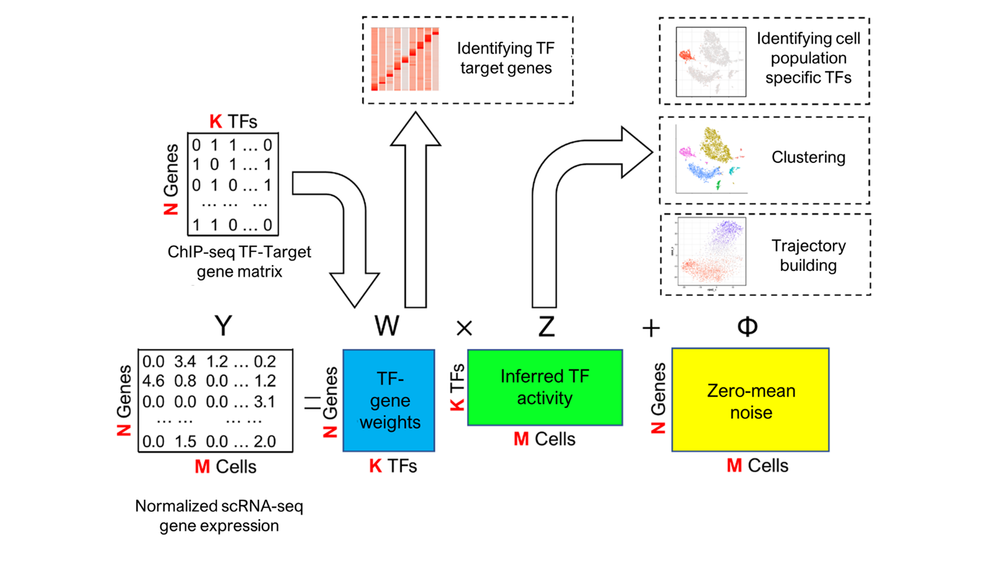
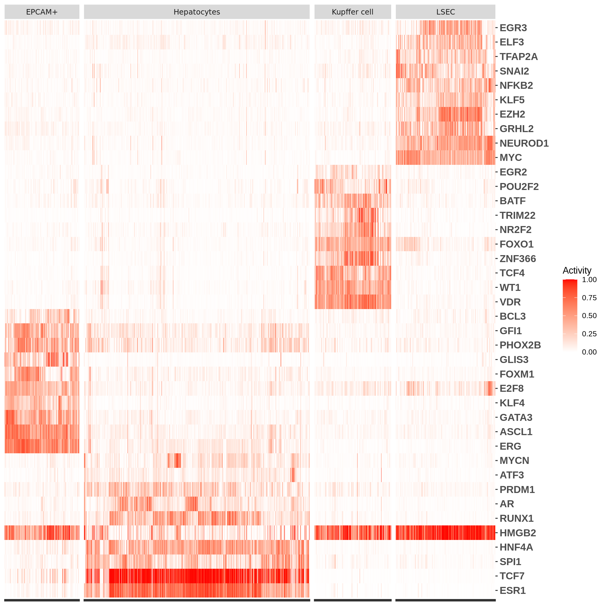

BITFAM user guide
================
# Introduction

Bayesian Inference Transcription Factor Activity model (BITFAM) is based on a fundamental biological principle that the differences in scRNA-seq profiles of individual cells reflect distinct underlying transcription factor activity states.

<!-- -->

The details about BITFAM are published in the journal Genome Research (2021) by Gao S et al. 

Please read and cite the following article when you use BITFAM:
[A Bayesian inference transcription factor activity model for the analysis of single-cell transcriptomes](https://genome.cshlp.org/content/early/2021/06/23/gr.265595.120).

# Work in progress (updated on Nov 9, 2021)

1, The current BITFAM package is based on [Rstan](https://mc-stan.org/rstan/). One known limitation is that the current version of BITFAM does not include the prior knwoledge of all transcription factors with existing ChIP-seq data because such a large number of parameters would massively increase the run time. BITFAM currently uses only differentially expressed transcription factors but we realize this is a limitation because many low expressed TFs could be missed as a consequence of the drop-out or limited depth of scRNA-seq data. Based on the feedback of users, we are therefore now trying to transfer the inference framework Rstan to [tensorflow probability](https://www.tensorflow.org/probability/overview) which will be able to handle more TFs (hopefully all TFs in GTRD) and likely also increase the robustness of the model. 

2, We are also updating the TF potential targets based on the latest version of GTRD database. Also, we are also looking into options to expand the approaches of identifying TF target genes as prior knowledge. 

# Convergence issue (updated on Jun 7, 2022)
There are some datasets in which the model does not lead to convergence of all inferred activities of transcription factors. In those cases, a **warning** I issued from rstan vb function. One solution is to increase the parameter *iter* (the number of max iterations, default is 8000) and decrease the parameter *tol_rel_obj* (the convergence tolerance on the relative norm of the objective, default is 0.005). However, this could lead to significantly longer running time. We believe this warning is caused by the non-convergence of selected transcription factors. These transcription factors might have a limited number of ChIP-seq datasets in the database, or the ChIP-seq datasets for these transcription factors may have been obtained from tissues or cell types that are not relevant to the tissue and cell types being interrogated by the user’s single cell RNA-seq data. Nevertheless, users may still be able to use the inferred activities of those TFs which converged to specific values.  We encourage users to assess whether the converged TF activity values may have biological significance even when disregarding the non-converged activities that prompted the warning.

# install dependent packages

## rstan

rstan is the R interface to Stan. You can have more information at
[rstan](https://mc-stan.org/rstan/) website.

### Installing from the repository

Ubuntu users on R\>=3.5.0 can install a binary version of RStan with

``` bash
# Add Michael Rutter's c2d4u3.5 PPA (and rrutter3.5 for CRAN builds too)
sudo add-apt-repository -y "ppa:marutter/rrutter3.5"
sudo add-apt-repository -y "ppa:marutter/c2d4u3.5"
sudo apt update
sudo apt install r-cran-rstan
```

### C++ toolchain configuration

The following will create or edit a configuration file for the C++
toolchain

``` r
dotR <- file.path(Sys.getenv("HOME"), ".R")
if (!file.exists(dotR)) dir.create(dotR)
M <- file.path(dotR, "Makevars")
if (!file.exists(M)) file.create(M)
cat("\nCXX14FLAGS=-O3 -march=native -mtune=native -fPIC",
    "CXX14=g++", # or clang++ but you may need a version postfix
    file = M, sep = "\n", append = TRUE)
```

### Installing RStan from source

``` r
install.packages("rstan", type = "source")
```

## Seurat

Seurat is a toolkit for single cell data analysis. You can have more
information at [Seurat](#seurat) (<https://satijalab.org/seurat/>)
website.

### installing Seurat

``` r
install.packages('Seurat')
```

# Quick start

## installing BITFAM

``` r
devtools::install_github("jaleesr/BITFAM")
```

``` r
library(BITFAM)
```

## preprocessing data

This is an optional step. BITFAM required the normalized scRNA-seq data.
If you have already normalized the data, you can go directly to the main
function in the next step.

``` r
data_matrix_normalized <- BITFAM_preprocess(raw_data = your_raw_data)
```

## infer the transcription factor activities

The function of BITFAM is to infer the transcription factor activities.
BITFAM is available for mouse and human. Mouse and human will have
different ChIP-seq target datasets. User should specify the species they
are using. The names of genes should be offical gene symbols. For mouse,
the gene names are first letter uppercase. For human, the gene names are
all letter uppercases.

``` r
head(rownames(data_matrix_normalized), n = 5)
```

    ## [1] "IGKC"            "IGHM"            "IGHA1"           "CYP3A7-CYP3A51P"
    ## [5] "MUC6"

By default, BITFAM will choose the transcription factors that are in the
most variable expressed genes to learn. But the users are also allowed to add transcription factors that they are interested in. If the users have their own scATAC-seq data which could be a supplemental filters to select the protential target genes, they can input the preprocessed Seurat object of scATAC-seq data wiht the augment scATAC_obj. Please note that these two functions are still under developing and testing. We highly recommend the users to try the default setting and contact us if you meet any problems.  

Here we use the adult liver single cell RNA-seq data as an example to show the usage of BITFAM main function. The data is publised in the paper: Aizarani, N., Saviano, A., Sagar et al. A human liver cell atlas reveals heterogeneity and epithelial progenitors (<https://www.nature.com/articles/s41586-019-1373-2>). Nature 572, 199–204 (2019). 

``` r

BITFAM_res <- BITFAM(data = data_matrix_normalized, species = "human", scATAC_obj = NA, ncores = parallel::detectCores())

```

    ## Loading required package: StanHeaders

    ## Loading required package: ggplot2

    ## rstan (Version 2.21.2, GitRev: 2e1f913d3ca3)

    ## For execution on a local, multicore CPU with excess RAM we recommend calling
    ## options(mc.cores = parallel::detectCores()).
    ## To avoid recompilation of unchanged Stan programs, we recommend calling
    ## rstan_options(auto_write = TRUE)

    ## Chain 1: ------------------------------------------------------------
    ## Chain 1: EXPERIMENTAL ALGORITHM:
    ## Chain 1:   This procedure has not been thoroughly tested and may be unstable
    ## Chain 1:   or buggy. The interface is subject to change.
    ## Chain 1: ------------------------------------------------------------
    ## Chain 1: 
    ## Chain 1: 
    ## Chain 1: 
    ## Chain 1: Gradient evaluation took 2.18435 seconds
    ## Chain 1: 1000 transitions using 10 leapfrog steps per transition would take 21843.5.
    ## Chain 1: Adjust your expectations accordingly!
    ## Chain 1: 
    ## Chain 1: 
    ## Chain 1: Begin eta adaptation.
    ## Chain 1: Iteration:   1 / 250 [  0%]  (Adaptation)
    ## Chain 1: Iteration:  50 / 250 [ 20%]  (Adaptation)
    ## Chain 1: Iteration: 100 / 250 [ 40%]  (Adaptation)
    ## Chain 1: Iteration: 150 / 250 [ 60%]  (Adaptation)
    ## Chain 1: Iteration: 200 / 250 [ 80%]  (Adaptation)
    ## Chain 1: Success! Found best value [eta = 1] earlier than expected.
    ## Chain 1: 
    ## Chain 1: Begin stochastic gradient ascent.
    ## Chain 1:   iter             ELBO   delta_ELBO_mean   delta_ELBO_med   notes 
    ## Chain 1:    100    -75444083.748             1.000            1.000
    ## Chain 1:    200    -16973934.385             2.222            3.445
    ## Chain 1:    300    -14879763.544             1.528            1.000
    ## ... ...
    ## ... ...
    ## Chain 1:   2800    -1286995.593             0.005            0.005   MEAN ELBO CONVERGED   MEDIAN ELBO CONVERGED
    ## Chain 1: 
    ## Chain 1: Drawing a sample of size 300 from the approximate posterior... 
    ## Chain 1: Completed.

Then we can get the inferred activities for every TF in each individual
cell by function BITFAM\_activities. The input is the result from BITFAM
main function.

``` r
Z <- BITFAM_activities(BITFAM_res)
```

A tsne plot on the inferred transcription factor activities.

``` r
library(ggplot2)
library(Rtsne)

Z_tsne <- as.data.frame(Rtsne(Z)$Y)
colnames(Z_tsne) <- c("tSNE_1", "tSNE_2")
Annotation <- read.table(system.file("extdata", "liver_cell_type.txt", package = "BITFAM"), stringsAsFactors = F, sep = "\t")
Z_tsne$Cell_type <- Annotation$cell_types
ggplot(Z_tsne, aes(tSNE_1, tSNE_2, color = Cell_type)) + geom_point(size=0.8)
```

<!-- -->


One of the utilities of inferring TF activities for each cell is the potential to generate profiles of cell-type specific TF activities. For this purpose, we used a random forest model to identify the inferred TF activities that were associated with specific cell types. For example, we labeled cells of a given cell type (identified by a biological label such as marker genes) as 1 and all other cells as 0. The random forest model is built using this cell label and the inferred transcription factors activities from the BITFAM  matrix. By applying the same model to each cell type, we generated a landscape of inferred TF activities across all cell types. And we could generate the heatmap of the inferred TF activities. Here the random forest model is one of the option. Users can choose their favourite method to identify the cell type specific TFs.

``` r

cell_type_df <- data.frame(Hepatocytes = ifelse(Annotation$cell_types == "Hepatocytes", 1, 0),
                           EPCAM = ifelse(Annotation$cell_types == "EPCAM+", 1, 0),
                           Kupffer = ifelse(Annotation$cell_types == "Kupffer cell", 1, 0),
                           LSEC = ifelse(Annotation$cell_types == "LSEC", 1, 0))
colnames(Z.vb.beta.prior)[20] <- "NKX3_1"

library(randomForest)
Z <- as.data.frame(Z)
Z_Hepatocytes <- cbind(Z, cell_type_df$Hepatocytes) 
colnames(Z_Hepatocytes)[157] <- "Hepatocytes"
Z_Hepatocytes$Hepatocytes <- factor(Z_Hepatocytes$Hepatocytes )
fit_rf <- randomForest(Hepatocytes~., data = Z_Hepatocytes)  ## build the RF model 
Hepatocytes_tf_top10 <- importance(fit_rf)[order(importance(fit_rf)[, 1], decreasing = T), ][1:10]  ## Based on the feature importances identify the specific TFs for Hepatocytes

## We repeat this code to the other 3 cell types.

Z_EPCAM <- cbind(Z, cell_type_df$EPCAM)
colnames(Z_EPCAM)[157] <- "EPCAM"
Z_EPCAM$EPCAM <- factor(Z_EPCAM$EPCAM)
fit_rf <- randomForest(EPCAM~., data = Z_EPCAM)
EPCAM_tf_top10 <- importance(fit_rf)[order(importance(fit_rf)[, 1], decreasing = T), ][1:10]

Z_Kupffer <- cbind(Z, cell_type_df$Kupffer)
colnames(Z_Kupffer)[157] <- "Kupffer"
Z_Kupffer$Kupffer <- factor(Z_Kupffer$Kupffer)
fit_rf <- randomForest(Kupffer~., data = Z_Kupffer)
Kupffer_tf_top10 <- importance(fit_rf)[order(importance(fit_rf)[, 1], decreasing = T), ][1:10]

Z_LSEC <- cbind(Z, cell_type_df$LSEC)
colnames(Z_LSEC)[157] <- "LSEC"
Z_LSEC$LSEC <- factor(Z_LSEC$LSEC)
fit_rf <- randomForest(LSEC~., data = Z_LSEC)
LSEC_tf_top10 <- importance(fit_rf)[order(importance(fit_rf)[, 1], decreasing = T), ][1:10]

## Build the inferred TF activities for selected TFs
selected_TF_Z <- Z[, names(c(Hepatocytes_tf_top10, EPCAM_tf_top10, Kupffer_tf_top10, LSEC_tf_top10))]
selected_TF_Z <- apply(selected_TF_Z, 2, function(x) (x-min(x))/(max(x)-min(x)))
label <- Annotation$cell_types

## Build the dataframe for heatmap
data_fr <- data.frame(cells = rep(rownames(selected_TF_Z), each = 40), TF = rep(colnames(selected_TF_Z), 6519), stringsAsFactors = F)
data_fr$activity <- as.vector(as.matrix(t(selected_TF_Z)))
data_fr$cell_type <- factor(rep(label, each = 40))
data_fr$TF <- factor(data_fr$TF, levels = colnames(selected_TF_Z))

## Generate heatmap figure
ggplot(data_fr, mapping = aes(x = cells, y = TF, fill = activity)) + geom_tile() +
  scale_fill_gradient(low = "white",    
                      high = "red",
                      name = "Activity") +
  scale_y_discrete(position = "right", label = colnames(selected_TF_Z)) +
  facet_grid(facets = ~cell_type,
             drop = TRUE,
             space = "free",
             scales = "free",
             aes(fill=cell_type)) +
  theme(axis.title.x=element_blank(),
        axis.text.x=element_blank(), 
        axis.title.y=element_blank(),
        axis.text.y=element_text(size = 12, face="bold"), 
        strip.text = element_text("none")) 
```
<!-- -->
